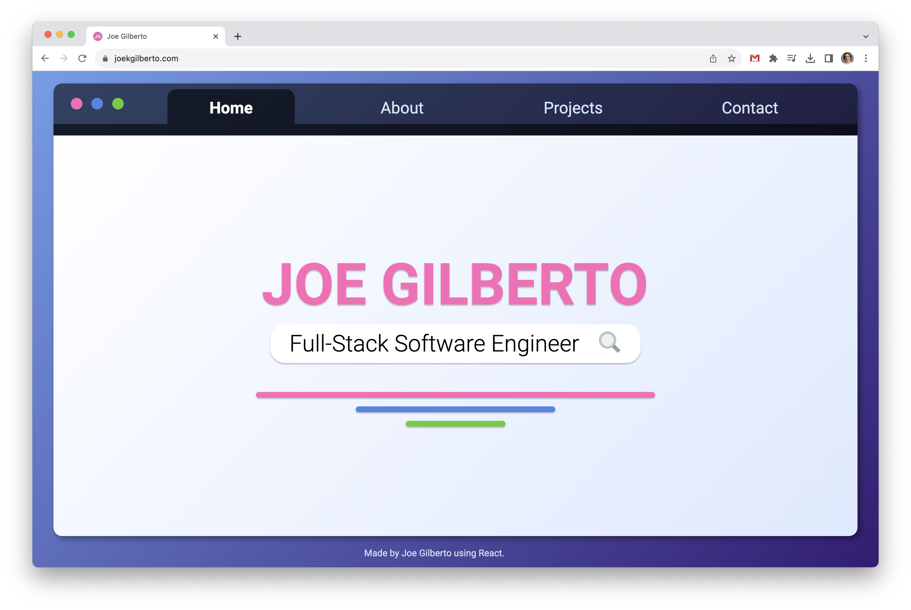

# Joe Gilberto

Hello!  I am Joe Gilberto, a full-stack software engineer who has completed a software engineering immersive through General Assembly, and this is my portfolio.  This portfolio contains some information about me, my contact information, my resume, and some projects I have worked on.

## Deployment
[See the live site here.](https://joekgilberto.com/)

## Technologies Used
This app utilizes JavaScript, JSON, CSS, React, and Node.js to showcase my career, my work, and a little bit about who I am.

## Acknowledgements
Thank you to [Wikimedia Commons](https://commons.wikimedia.org/wiki/Main_Page) for providing the following public domain images:
- [Search icon](https://commons.wikimedia.org/wiki/File:Search-icon.png)
- [Document icon](https://commons.wikimedia.org/wiki/File:Document_(89521)_-_The_Noun_Project.svg)
- [Pin icon](https://commons.wikimedia.org/wiki/File:Pin_point_location_SVG_black.svg)
- [Coding icon](https://commons.wikimedia.org/wiki/File:Icon_(80027)_-_The_Noun_Project.svg)

## Future Features
1. Will add a contact form and submission.
2. Will add further projects as they develop.